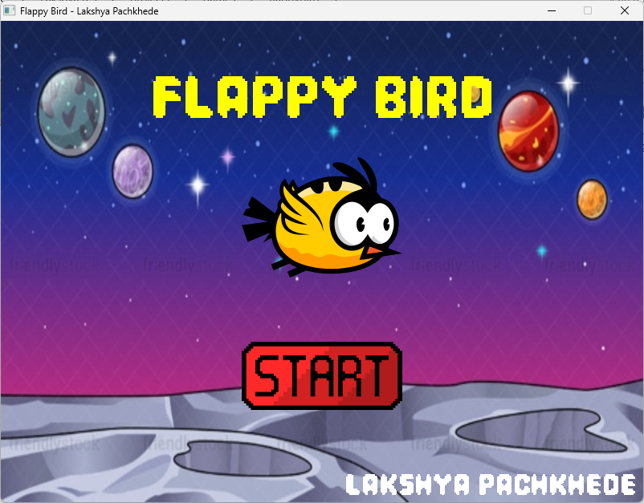
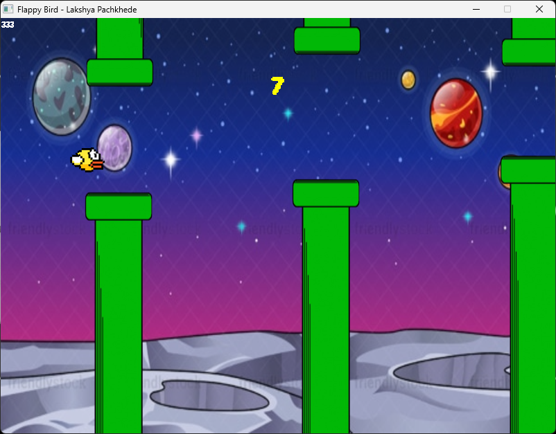
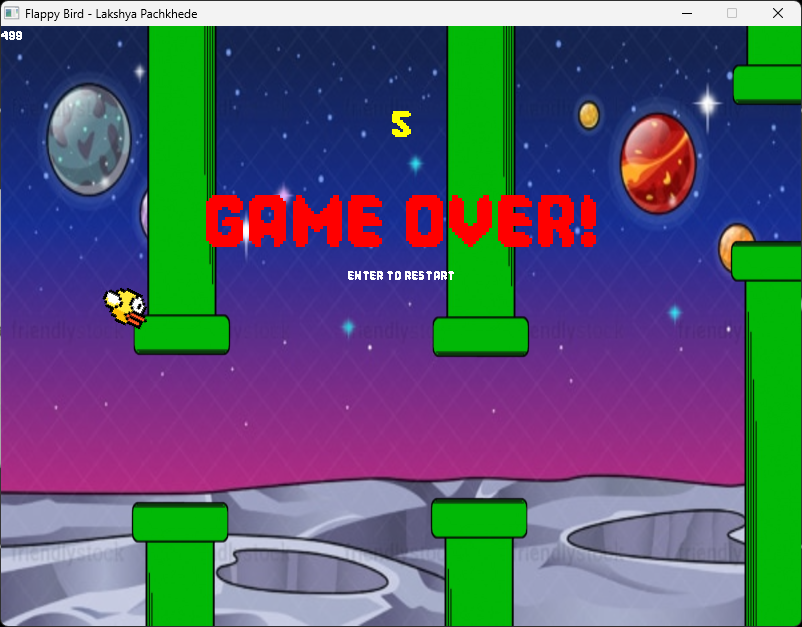

# Flappy Bird (C + SDL2)

A lightweight Flappy Bird clone written in C using SDL2, SDL2_image,
SDL2_ttf, and SDL2_mixer.

------------------------------------------------------------------------

## Demo Screenshots

Menu Screen\


Gameplay\


Game Over\


------------------------------------------------------------------------

## Features

-   Smooth physics-based bird movement\
-   Random pipe generation\
-   Score system with sound effects\
-   Custom fonts\
-   Optimized rendering\
-   Modular structured C code\
-   Clean folder layout

------------------------------------------------------------------------

## Folder Structure

    E:.
    │   Flappy.exe
    │   SDL2.dll
    │   SDL2_image.dll
    │   SDL2_mixer.dll
    │   SDL2_ttf.dll
    │
    ├───assets
    │   ├───audio
    │   ├───fonts
    │   └───img
    ├───demo
    ├───libs
    └───src

------------------------------------------------------------------------

## Build Instructions (Windows MinGW)

1.  Install **SDL2**, **SDL2_image**, **SDL2_ttf**, **SDL2_mixer**
2.  Add the include and lib paths in your compiler flags:

```{=html}
<!-- -->
```
    -I libs/sdl2/include
    -L libs/sdl2/lib

3.  Compile:

```{=html}
<!-- -->
```
    gcc -o Flappy.exe src/*.c -lmingw32 -lSDL2main -lSDL2 -lSDL2_image -lSDL2_mixer -lSDL2_ttf

------------------------------------------------------------------------

## Gameplay

Press **Up Key** or **Left Mouse Button** to flap.\
Avoid pipes and survive as long as possible.

------------------------------------------------------------------------

## Credits

Developed by **Lakshya Pachkhede**\
Assets sourced for personal educational use.

------------------------------------------------------------------------
